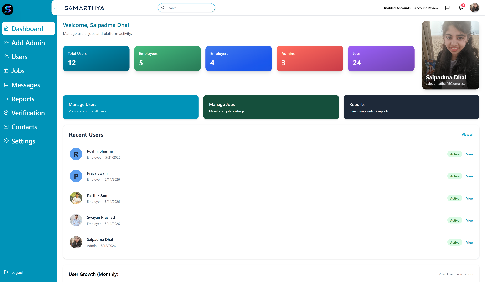
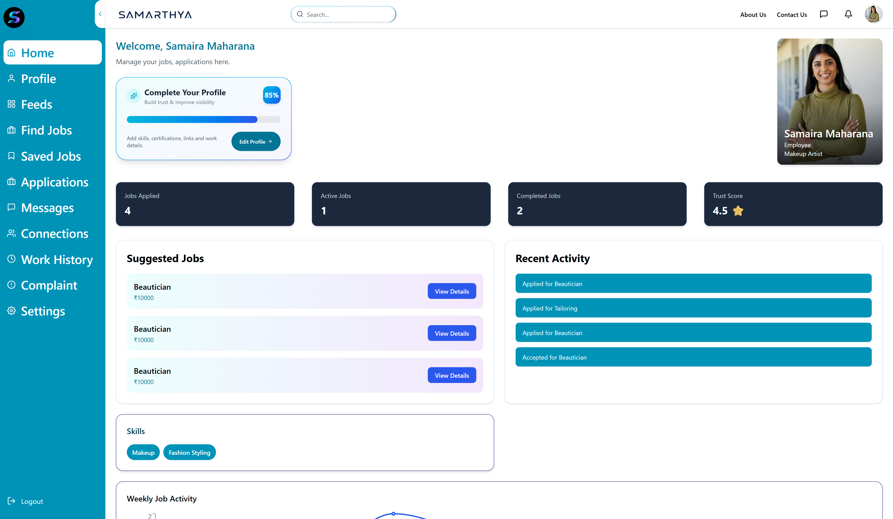
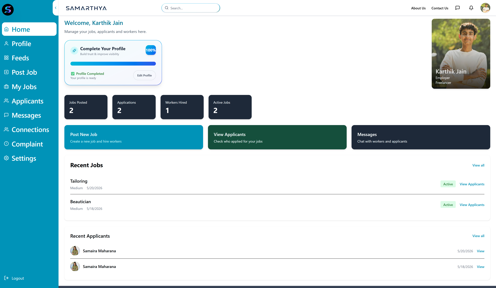

# Samarthya – Skill based Inclusive Local Employment Platform

## Project Type
Team Project

## Description
Samarthya is a skill based local employment platform designed to provide inclusive job opportunities through role-based access for Admin, Employer, and Employee users
using MERN Stack.

The platform supports secure authentication, job posting, applications, account management, notifications, and admin moderation.

## Features
- User Authentication (Login / Signup)
- Role-Based Access (Admin, Employer, Employee)
- Job Posting & Job Applications
- Admin Dashboard
- User Management
- Employee Dashboard
- Employer Dashboard
- Report or Complaint Features
- Notifications
- Account Review & Moderation

## Tech Stack
### Frontend
- React.js
- Tailwind CSS
- Axios

### Backend
- Node.js
- Express.js

### Database
- MongoDB

## My Contributions
- Developed the complete Admin Module
- Admin User Management(View, Block, Suspend)
- Employee Dashboard Development
- UI Improvements
- Frontend & Backend Integration
- API integration using Axios

## Installation

Clone repository:

```bash
git clone https://github.com/Saipadma08/Samarthya-Project.git
```

Install dependencies:

```bash
npm install
```

Run frontend/backend:

```bash
npm run dev
```

## Note
This was developed as a team project. My contributions are specifically mentioned above.


# Screenshots

## Login Page


---

## Admin Dashboard


---

## Employee Dashboard


---

## Employer Dashboard

